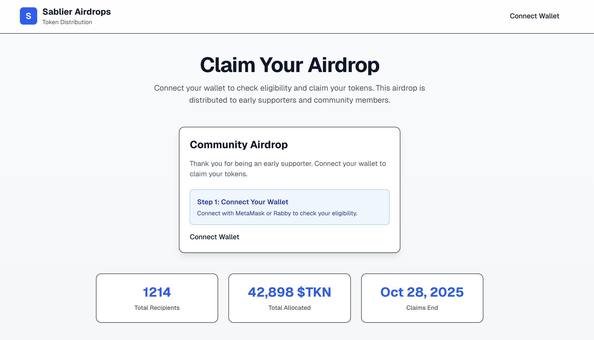

# Sablier Airdrops Sandbox

Customizable frontend for Sablier airdrop claim pages. Recipients connect their wallet and claim tokens distributed via
Sablier's Merkle contracts.



## Features

- 🔗 Wallet connection (MetaMask & Rabby via RainbowKit)
- 🌳 Merkle proof generation & verification (OpenZeppelin)
- ✅ Claim eligibility checking
- 💸 Token claiming with transaction tracking
- 🎨 Customizable branding and messaging
- 🔒 Compatible with Sablier Airdrops v2.0 contracts

## Tech Stack

- **Framework**: Next.js 15+ (App Router)
- **Styling**: Tailwind CSS v4
- **Language**: TypeScript (strict mode)
- **Web3**: viem, wagmi, RainbowKit
- **Merkle Trees**: OpenZeppelin SDK
- **Package Manager**: bun

## Prerequisites

Before getting started, ensure you have the following CLI tools installed:

- **[bun](https://bun.sh)** - Fast all-in-one JavaScript runtime and package manager
- **[just](https://github.com/casey/just)** - Command runner for project tasks

## Quick Start

1. **Install dependencies:**

   ```bash
   bun install
   ```

2. **Configure environment variables:** Copy `.env.example` to `.env.local` and fill in:
   - WalletConnect Project ID
   - Merkle root hash
   - Airdrop contract address
   - Chain ID
   - IPFS URL for Merkle tree JSON

3. **Run development server:**

   ```bash
   just dev
   ```

4. **Build for production:**
   ```bash
   just build
   ```

## Commands

See [justfile](./justfile) for all available commands:

- `just dev` - Start development server
- `just build` - Production build
- `just full-check` - Lint, format check, type check
- `just full-write` - Auto-fix all issues

## Customization

This sandbox is designed for easy customization. Look for `/* CUSTOMIZATION POINT */` comments throughout the codebase.

Key areas to customize:

- Campaign metadata (name, description, dates)
- Brand colors and logo
- Success/error messages
- Contract addresses and network configuration

See [CUSTOMIZATION.md](./CUSTOMIZATION.md) for detailed instructions.

## Merkle Tree Generation

Generate the Merkle tree for your airdrop recipients:

```bash
bun run scripts/generate-merkle-tree.ts data/recipients.json data/merkle-tree.json
```

This creates:

- `data/merkle-tree.json` - Full tree data (for frontend proof generation)
- `data/merkle-tree.env.txt` - Environment variables (copy to `.env.local`)

The Merkle root from this output must match the root used when deploying your Sablier airdrop contract.

## Contract Compatibility

Compatible with Sablier Airdrops v2.0:

- SablierMerkleInstant
- SablierMerkleLL (Linear Lockup)
- SablierMerkleLT (Tranched Lockup)

## Deployment

### Vercel (Recommended)

1. Push your customized code to GitHub
2. Import project to Vercel
3. Configure environment variables in Vercel dashboard
4. Deploy

## Documentation

- [CUSTOMIZATION.md](./CUSTOMIZATION.md) - Detailed customization guide
- [DESIGN.md](./DESIGN.md) - Design system and component library
- [CONTRIBUTING.md](./CONTRIBUTING.md) - Contribution guidelines
- [Sablier Docs](https://docs.sablier.com) - Official Sablier documentation

## License

This project is licensed under the MIT License - see [LICENSE.MD](./LICENSE.MD).

## Disclaimer

This software is provided "AS IS", without warranty of any kind, express or implied, including but not limited to the warranties of merchantability, fitness for a particular purpose, and noninfringement. In no event shall the authors or copyright holders be liable for any claim, damages, or other liability, whether in an action of contract, tort, or otherwise, arising from, out of, or in connection with the software or the use or other dealings in the software.

Users are solely responsible for ensuring the correctness and security of their airdrop configurations, Merkle trees, and smart contract deployments.
