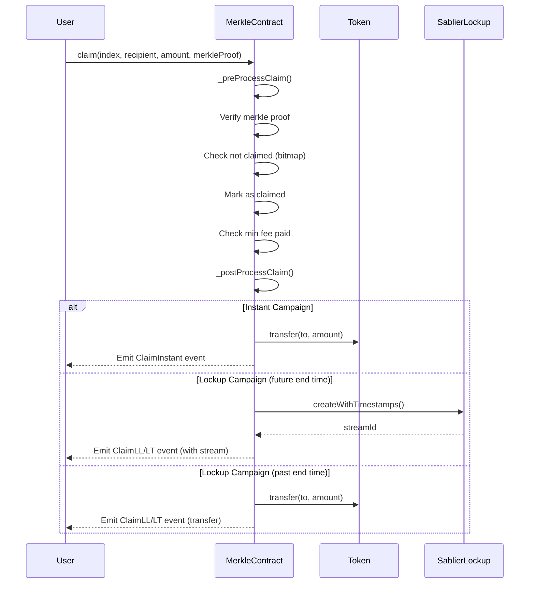

# Sablier Airdrops - Technical Architecture

## Overview

Sablier Airdrops is a production-grade smart contract system for distributing ERC-20 tokens using Merkle tree-based
verification. The system supports multiple distribution models ranging from instant claims to sophisticated vesting
schedules.

**Repository:** https://github.com/sablier-labs/airdrops/tree/v2.0 **Package:** `@sablier/airdrops` **Security:**
Audited by Cantina and independent auditors **Dependencies:** OpenZeppelin Contracts v5.3.0, PRB Math v4.1.0, Sablier
Lockup

---

## Contract Architecture

### Core Contract Types

The system comprises four primary Merkle campaign types, each with corresponding factory contracts:

#### 1. **SablierMerkleInstant** (Instant Distribution)

- **Purpose:** Immediate token transfer upon claim
- **Factory:** `SablierFactoryMerkleInstant`
- **Use Case:** Simple airdrops without vesting
- **Contract Address (Mainnet):** Factory at `0x71DD3Ca88E7564416E5C2E350090C12Bf8F6144a`

#### 2. **SablierMerkleLL** (Linear Lockup)

- **Purpose:** Tokens vest linearly over time using Sablier Lockup Linear streams
- **Factory:** `SablierFactoryMerkleLL`
- **Use Case:** Linear vesting with optional cliff and initial unlock
- **Features:**
  - Configurable cliff duration
  - Cliff unlock percentage
  - Start unlock percentage
  - Total vesting duration

#### 3. **SablierMerkleLT** (Tranched Lockup)

- **Purpose:** Tokens vest in discrete tranches/milestones using Sablier Lockup Tranched streams
- **Factory:** `SablierFactoryMerkleLT`
- **Use Case:** Multi-stage vesting (e.g., monthly unlocks)
- **Features:**
  - Multiple tranches with individual unlock percentages
  - Configurable duration per tranche

#### 4. **SablierMerkleVCA** (Variable Claim Amount)

- **Purpose:** Linear vesting where users can claim anytime but forfeit unvested tokens
- **Factory:** `SablierFactoryMerkleVCA`
- **Use Case:** Early claim penalty model
- **Features:**
  - Initial unlock percentage
  - Linear vesting of remainder
  - Tracks forfeited tokens (`totalForgoneAmount`)

### Inheritance Hierarchy

```
SablierMerkleBase (abstract)
├── SablierMerkleInstant
└── SablierMerkleLockup (abstract)
    ├── SablierMerkleLL
    ├── SablierMerkleLT
    └── SablierMerkleVCA

SablierFactoryMerkleBase (abstract)
├── SablierFactoryMerkleInstant
├── SablierFactoryMerkleLL
├── SablierFactoryMerkleLT
└── SablierFactoryMerkleVCA
```

---

## Key Data Structures

### Constructor Parameters

#### MerkleInstant.ConstructorParams

```solidity
struct ConstructorParams {
    string campaignName;
    uint40 campaignStartTime;
    uint40 expiration;          // Optional (0 = no expiration)
    address initialAdmin;
    string ipfsCID;              // Campaign metadata
    bytes32 merkleRoot;
    IERC20 token;
}
```

#### MerkleLL.ConstructorParams

```solidity
struct ConstructorParams {
    string campaignName;
    uint40 campaignStartTime;
    bool cancelable;
    uint40 cliffDuration;
    UD2x18 cliffUnlockPercentage;    // Fixed-point percentage
    uint40 expiration;
    address initialAdmin;
    string ipfsCID;
    ISablierLockup lockup;           // Sablier Lockup contract
    bytes32 merkleRoot;
    LockupLinear.Shape shape;
    UD2x18 startUnlockPercentage;
    IERC20 token;
    uint40 totalDuration;
    bool transferable;
    uint40 vestingStartTime;
}
```

#### MerkleLT.ConstructorParams

```solidity
struct ConstructorParams {
    string campaignName;
    uint40 campaignStartTime;
    bool cancelable;
    uint40 expiration;
    address initialAdmin;
    string ipfsCID;
    ISablierLockup lockup;
    bytes32 merkleRoot;
    LockupTranched.Shape shape;
    IERC20 token;
    TrancheWithPercentage[] tranchesWithPercentages;
    bool transferable;
    uint40 vestingStartTime;
}

struct TrancheWithPercentage {
    UD2x18 unlockPercentage;
    uint40 duration;
}
```

#### MerkleVCA.ConstructorParams

```solidity
struct ConstructorParams {
    string campaignName;
    uint40 campaignStartTime;
    uint40 expiration;
    address initialAdmin;
    string ipfsCID;
    bytes32 merkleRoot;
    IERC20 token;
    UD2x18 unlockPercentage;     // Initial unlock percentage
    uint40 vestingEndTime;
    uint40 vestingStartTime;
}
```

---

## Claim Flow (User Perspective)

### Standard Claim Process



### Claim Function Signatures

All Merkle contracts support three claim methods:

#### 1. Standard Claim (to self)

```solidity
function claim(
    uint256 index,
    address recipient,
    uint128 amount,
    bytes32[] calldata merkleProof
) external payable;
```

#### 2. Claim to Another Address

```solidity
function claimTo(
    uint256 index,
    address to,
    uint128 amount,
    bytes32[] calldata merkleProof
) external payable;
```

#### 3. Claim via Signature (Gasless/Delegated)

```solidity
function claimViaSig(
    uint256 index,
    address recipient,
    address to,
    uint128 amount,
    uint40 validFrom,
    bytes32[] calldata merkleProof,
    bytes calldata signature
) external payable;
```

### Claim Parameters Explained

| Parameter     | Type        | Description                                                        |
| ------------- | ----------- | ------------------------------------------------------------------ |
| `index`       | `uint256`   | Unique identifier for the recipient in the Merkle tree (0-indexed) |
| `recipient`   | `address`   | The eligible recipient address (leaf node in Merkle tree)          |
| `to`          | `address`   | Destination address for tokens/stream (can differ from recipient)  |
| `amount`      | `uint128`   | Total allocated tokens for this recipient                          |
| `merkleProof` | `bytes32[]` | Merkle proof array verifying inclusion in tree                     |
| `validFrom`   | `uint40`    | Timestamp when signature becomes valid (signature claims only)     |
| `signature`   | `bytes`     | EIP-712 signature for delegated claims                             |

### VCA-Specific Claim Logic

For **SablierMerkleVCA**, the claimable amount is calculated dynamically:

```solidity
// Simplified logic
unlockAmount = amount * UNLOCK_PERCENTAGE;
remainingAmount = amount - unlockAmount;
elapsedTime = block.timestamp - VESTING_START_TIME;
totalDuration = VESTING_END_TIME - VESTING_START_TIME;

if (block.timestamp < VESTING_START_TIME) {
    claimAmount = 0; // Cannot claim before start
} else if (block.timestamp >= VESTING_END_TIME) {
    claimAmount = amount; // Full amount claimable
} else {
    vestedAmount = (remainingAmount * elapsedTime) / totalDuration;
    claimAmount = unlockAmount + vestedAmount;
}

forgoneAmount = amount - claimAmount; // Forfeited tokens
```

---

## Contract Interactions

### Factory Pattern (Deployment)

To create a new campaign, interact with the appropriate factory contract:

```solidity
// Example: Deploy MerkleInstant campaign
ISablierMerkleInstant campaign = factory.createMerkleInstant(
    MerkleInstant.ConstructorParams({
        campaignName: "Community Airdrop",
        campaignStartTime: uint40(block.timestamp),
        expiration: uint40(block.timestamp + 90 days),
        initialAdmin: msg.sender,
        ipfsCID: "QmXyz...",
        merkleRoot: 0xabc123...,
        token: IERC20(tokenAddress)
    }),
    aggregateAmount: 1_000_000e18,    // Total tokens
    recipientCount: 5000               // Number of eligible recipients
);
```

**Factory Uses CREATE2:** Deployments are deterministic based on:

```solidity
salt = keccak256(abi.encodePacked(
    msg.sender,
    comptroller,
    abi.encode(params)
));
```

### Required Contract Approvals

**For Lockup Campaigns (LL, LT, VCA):**

- The deployed Merkle contract automatically approves `type(uint256).max` to the Sablier Lockup contract
- Campaign creator must transfer aggregate amount to Merkle contract before claims

**For Instant Campaigns:**

- Campaign creator must transfer aggregate amount to Merkle contract

---

## Events

### Base Events (All Campaigns)

```solidity
event Clawback(
    address indexed admin,
    address indexed to,
    uint128 amount
);

event LowerMinFeeUSD(
    address indexed comptroller,
    uint256 newMinFeeUSD,
    uint256 previousMinFeeUSD
);
```

### Campaign-Specific Events

#### MerkleInstant

```solidity
event ClaimInstant(
    uint256 index,
    address indexed recipient,
    uint128 amount,
    address to,
    bool viaSig
);
```

#### MerkleLL (Linear Lockup)

```solidity
event ClaimLLWithTransfer(
    uint256 index,
    address indexed recipient,
    uint128 amount,
    address to,
    bool viaSig
);

event ClaimLLWithVesting(
    uint256 index,
    address indexed recipient,
    uint128 amount,
    address to,
    uint256 streamId,
    bool viaSig
);
```

#### MerkleLT (Tranched Lockup)

```solidity
event ClaimLTWithTransfer(
    uint256 index,
    address indexed recipient,
    uint128 amount,
    address to,
    bool viaSig
);

event ClaimLTWithVesting(
    uint256 index,
    address indexed recipient,
    uint128 amount,
    address to,
    uint256 streamId,
    bool viaSig
);
```

#### MerkleVCA

```solidity
event ClaimVCA(
    uint256 index,
    address indexed recipient,
    uint128 amount,
    address to,
    uint128 claimAmount,
    uint128 forgoneAmount,
    bool viaSig
);
```

### Factory Events

```solidity
event CreateMerkleInstant(
    ISablierMerkleInstant indexed merkleInstant,
    MerkleInstant.ConstructorParams params,
    uint256 aggregateAmount,
    uint256 recipientCount,
    address comptroller,
    uint256 minFeeUSD
);

// Similar events for LL, LT, VCA factories
```

---

## Integration Requirements

### Merkle Tree Generation

The system uses **standard Merkle trees** compatible with OpenZeppelin's implementation.

**Leaf Node Format:**

```solidity
leaf = keccak256(abi.encodePacked(index, recipient, amount));
```

**Tools:**

- **Official:** [Sablier Merkle API](https://github.com/sablier-labs/merkle-api) (Rust-based REST API)
- **Compatible:** [OpenZeppelin Merkle Tree Library](https://github.com/OpenZeppelin/merkle-tree) (JavaScript)

**CSV Input Format (for Sablier Merkle API):**

```csv
index,address,amount
0,0x1234...,1000000000000000000
1,0x5678...,2500000000000000000
```

### OpenZeppelin Compatibility

Sablier uses **OpenZeppelin Contracts v5.3.0**.

**Merkle Proof Verification:**

```solidity
// Internal verification (simplified)
bytes32 leaf = keccak256(abi.encodePacked(index, recipient, amount));
bool valid = MerkleProof.verify(merkleProof, MERKLE_ROOT, leaf);
```

To generate proofs using OpenZeppelin's JS library:

```typescript
import { StandardMerkleTree } from "@openzeppelin/merkle-tree";

// Build tree
const tree = StandardMerkleTree.of(
  [
    [0, "0x1234...", "1000000000000000000"],
    [1, "0x5678...", "2500000000000000000"],
  ],
  ["uint256", "address", "uint256"],
);

// Get proof for specific recipient
const proof = tree.getProof([0, "0x1234...", "1000000000000000000"]);
```

### Fee Requirements

Campaigns enforce a **minimum claim fee** to prevent spam:

```solidity
uint256 minFeeWei = calculateMinFeeWei();
require(msg.value >= minFeeWei, "Insufficient fee");
```

- Fee is denominated in USD (`minFeeUSD`) but paid in native token (ETH, MATIC, etc.)
- Converted to wei using an oracle/comptroller
- Comptroller can lower fee via `lowerMinFeeUSD()`

---

## Contract Addresses

### Mainnets

| Network  | Factory Address                              |
| -------- | -------------------------------------------- |
| Ethereum | `0x71DD3Ca88E7564416E5C2E350090C12Bf8F6144a` |
| Polygon  | `0xf0d61b42311C810dfdE191D58427d81E87c5d5F6` |
| Arbitrum | `0x7efd170e3e32Dc1b4c17eb4cFFf92c81FF43a6cb` |
| Base     | `0xD9e108f26fe104CE1058D48070438deDB3aD826A` |

### Testnets

| Network          | Factory Address                              |
| ---------------- | -------------------------------------------- |
| Sepolia          | `0xf642751d1271c88bBb8786067de808B32a016Fd4` |
| Arbitrum Sepolia | `0x465E9218C1A8d36169e0c40C01b856A83CE44153` |
| Base Sepolia     | `0x6a3466398A66c7Ce801989B45C390cdC8717102D` |

**Note:** These are `SablierMerkleFactory` addresses (v1.3). All contracts are non-upgradeable and verified on block
explorers.

**Full List:** https://docs.sablier.com/guides/airdrops/deployments

---

## Security & Optimization Features

### Claim Tracking

- Uses **bitmap** (`_claimedBitMap`) for gas-efficient claim status tracking
- Single storage slot can track 256 claims
- `hasClaimed(index)` checks bit at position `index`

### CEI Pattern

Internal functions follow **Checks-Effects-Interactions**:

1. `_preProcessClaim()`: Validates proof, checks bitmap, marks as claimed
2. `_postProcessClaim()`: Executes token transfer or stream creation

### Admin Controls

- **Clawback:** Admin can recover unclaimed tokens after expiration
- **Fee Management:** Comptroller can reduce minimum fee (never increase)
- **Non-upgradeable:** All contracts are immutable after deployment

### Gas Optimizations

- Immutable variables for frequently accessed data
- Bitmap for claim status (vs. mapping)
- CREATE2 for deterministic deployments
- Max approval done once in constructor (Lockup campaigns)

---

## Common Integration Patterns

### 1. Frontend Claim Interface

```typescript
// Fetch user's eligibility
const eligibility = await fetch(`https://merkle-api.sablier.com/campaign/${campaignId}/eligibility/${userAddress}`);

const { index, amount, proof } = await eligibility.json();

// Execute claim
const tx = await merkleContract.claim(index, userAddress, amount, proof, { value: minFeeWei });
```

### 2. Gasless Claims (via Signature)

```typescript
// User signs EIP-712 message off-chain
const domain = {
  name: campaignName,
  version: "1",
  chainId: chainId,
  verifyingContract: merkleContractAddress,
};

const types = {
  Claim: [
    { name: "index", type: "uint256" },
    { name: "recipient", type: "address" },
    { name: "to", type: "address" },
    { name: "amount", type: "uint128" },
    { name: "nonce", type: "uint256" },
    { name: "validFrom", type: "uint40" },
  ],
};

const signature = await signer._signTypedData(domain, types, value);

// Relayer submits transaction
await merkleContract.claimViaSig(index, recipient, to, amount, validFrom, proof, signature, { value: minFeeWei });
```

### 3. Campaign Creation Flow

```typescript
1. Generate Merkle tree from recipient list
2. Deploy campaign via factory contract
3. Transfer aggregate tokens to deployed campaign
4. Publish Merkle tree (IPFS/API)
5. Users query tree and claim with proofs
```

---

## Compatibility Considerations

### ERC-20 Token Requirements

- Must implement standard `transfer()` function
- Native token (ETH, MATIC) **not supported** as airdrop token
- Fee-on-transfer tokens may cause accounting issues

### Sablier Lockup Integration

- Lockup campaigns (LL, LT) require deployed Sablier Lockup contract
- Lockup contract address must be provided in constructor
- Streams inherit cancelability and transferability settings

### Chain Compatibility

- Deployed on all major EVM chains
- No chain-specific dependencies
- Uses standard Solidity 0.8+ features

### Timestamp Precision

- All timestamps are `uint40` (sufficient until year ~36,000)
- Vesting calculations use seconds (not block numbers)

---

## Advanced Features

### Multiple Claims per Recipient

- **Not supported by design**
- Each `index` can only be claimed once
- To support multiple claims, include multiple entries with different indices

### Campaign Expiration

- Optional `expiration` parameter in constructor
- After expiration:
  - Claims are blocked
  - Admin can call `clawback()` to recover unclaimed tokens
- Set to `0` for no expiration

### IPFS Metadata

- `ipfsCID` field stores campaign metadata
- Can include:
  - Campaign description
  - Recipient list (cleartext or encrypted)
  - Merkle tree JSON
  - Terms and conditions

### Stream Ownership

- For Lockup campaigns, stream NFT is minted to `to` address
- Streams are transferable if `transferable = true`
- Stream holder can withdraw vested tokens anytime

---

## Testing & Development

### Local Development

```bash
# Clone repository
git clone https://github.com/sablier-labs/airdrops.git
cd airdrops
git checkout v2.0

# Install dependencies
bun install

# Compile contracts
forge build

# Run tests
forge test

# Format code
forge fmt
```

### Testing with Mainnet Fork

```bash
# Fork Ethereum mainnet
forge test --fork-url $ETH_RPC_URL

# Test specific campaign
forge test --match-contract MerkleInstantTest
```

### Bulloak Testing Pattern

The codebase uses **Branching Tree Technique (BTT)** for comprehensive test coverage:

- Each function has dedicated test contract
- Tests organized by scenario/branch
- Example: `MerkleInstant.t.sol` with `MerkleInstant.tree.sol`

---

## References

- **Documentation:** https://docs.sablier.com
- **GitHub:** https://github.com/sablier-labs/airdrops
- **Merkle API:** https://github.com/sablier-labs/merkle-api
- **OpenZeppelin Merkle Tree:** https://github.com/OpenZeppelin/merkle-tree
- **Audits:** Available in `/audits` directory
- **Discord:** https://discord.gg/bSwRCwWRsT

---

## Summary Checklist

**For Claiming:**

- [ ] Obtain `index`, `amount`, and `merkleProof` from Merkle tree
- [ ] Calculate `minFeeWei` from contract
- [ ] Call `claim()` or `claimTo()` with `msg.value >= minFeeWei`
- [ ] Listen for `Claim*` event to confirm success

**For Integration:**

- [ ] Generate Merkle tree with `keccak256(abi.encodePacked(index, recipient, amount))`
- [ ] Deploy campaign via factory with correct parameters
- [ ] Transfer aggregate tokens to deployed contract
- [ ] Provide API/interface for users to fetch their proofs
- [ ] Handle three claim methods (standard, claimTo, claimViaSig)

**For VCA Campaigns:**

- [ ] Display real-time claimable amount calculation
- [ ] Show forgone amount for early claims
- [ ] Explain vesting schedule to users

**For Lockup Campaigns:**

- [ ] Verify Sablier Lockup contract address
- [ ] Configure vesting parameters (cliff, tranches, etc.)
- [ ] Set cancelability and transferability
- [ ] Explain stream mechanics to recipients
